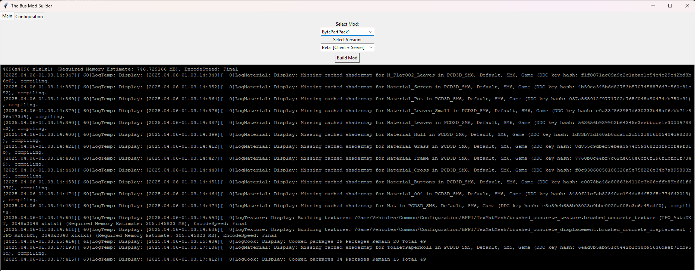
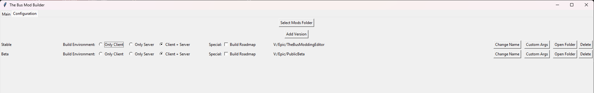
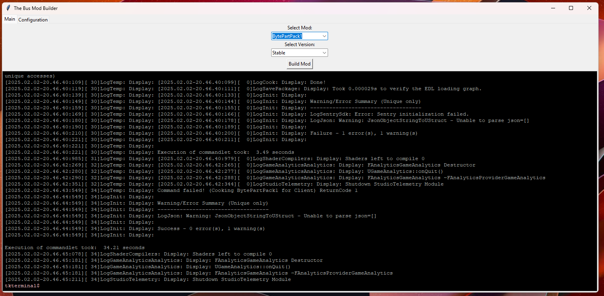

# The Bus Mod Builder

This simple tool allows you to build any mod you created inside the "The Bus Modding Editor" without opening it.

[Download V003 here](https://github.com/ByteBitter/TheBusModBuilder/releases/tag/V003.2)



## DISCLAIMER - USE AT YOUR OWN RISK

**This tool was created independently and is not affiliated with TML Studios.** 
If you run into any issues, feel free to reach out to me directly here for help. Thanks a bunch!

This software was made with my last 3 braincells and a little help of ChatGPT so... **Use it at your own risk**

If anything goes wrong, I am not responsible. You have been warned.

Happy Modding!


## Requirements

You need the [The Bus Modding Editor](https://store.epicgames.com/de/p/the-bus-modding-editor) installed on your PC.

Check out the developers dicord server, there you can find all the information you need:

[TML Studios Discord Server](https://discord.gg/tml-studios-224563159631921152)


## Config

When using the tool for the first time, you need to configure at least one "Version" and your "Mods" directory:

1. Switch to the "Configuration" tab and click on "Select Mods Folder" to select the Mods Folder and after that on "Add version"

2. Enter a Name for the version - this can be anything you want ('stable', 'beta', ...)

3. After entering the name, the tool will open a folder selection dialog - now navigate to the root folder of your modding editor installation and click "select folder", for me it is: `V:\Epic\TheBusModdingEditor`

4. Now you should see the config in the "Configuration" tab and there should be a `mod_config.json` file inside the folder where the tool is stored

5. Select your desired evironment (server, client or both) -> these will be displayed on the main tab in the version dropdown. You can have multible Versions with the same name and different evironment settings

6. (optional) you can add custom build arguments: click on the "Custom Args" button next to a config and write the arguments into the popup. - build arguments are stored separatly for each created version




#### JSON Example

```
{
    "versions": {
        "1e49c67d-7288-449b-9e96-997dfd8cbc43": {
            "name": "Stable",
            "path": "V:/Epic/TheBusModdingEditor",
            "extra_args": "",
            "build_roadmap": false,
            "build_environment": 1
        },
        "047aa805-bdcc-4a16-b8bf-40da20d7d75e": {
            "name": "Stable",
            "path": "V:/Epic/TheBusModdingEditor",
            "extra_args": "",
            "build_roadmap": false,
            "build_environment": 2
        }
    },
    "modsFolder": "C:/Users/nikla/Documents/The Bus/Mods"
}
```


## How to use the tool


1. Select the Mod
2. Select the Version
3. Hit the "Build Mod" Button
4. Wait - building a mod can take a while

The process is done, when the red-ish `tkterminal$` at the bottom of the console window is shown.


5. Start "The Bus" and test or upload your mod


## Nerd stuff - whats inside?

- Python
- tkinter
- tkterminal

### Tools I used:
- VS Code
- auto-py-to-exe 


